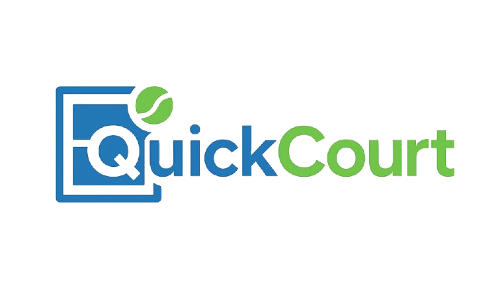

# QuickCourt — A Local Sports Facility Booking Platform

<br />
<div align="center">
  <a href="https://github.com/Aaditya-T/QuickCourt">
    
  </a>

  <h3 align="center">QuickCourt</h3>

  <p align="center">
    A modern sports facility booking platform that connects players with local courts and enables community match organization
    <br />
    <strong>🏆 Odoo Hackathon August 2025</strong>
    <br />
    Built by Team ZeroDay
  </p>
</div>

<!-- TABLE OF CONTENTS -->
<details>
  <summary>Table of Contents</summary>
  <ol>
    <li><a href="#-achievement">Achievement</a></li>
    <li><a href="#-contributors">Contributors</a></li>
    <li><a href="#why-quickcourt">Why QuickCourt?</a></li>
    <li><a href="#project-purpose">Project Purpose</a></li>
    <li><a href="#key-features">Key Features</a></li>
    <li><a href="#tech-stack">Tech Stack</a></li>
    <li><a href="#getting-started">Getting Started</a></li>
    <li><a href="#project-structure">Project Structure</a></li>
    <li><a href="#architecture--scalability">Architecture & Scalability</a></li>
    <li><a href="#performance--metrics">Performance & Metrics</a></li>
    <li><a href="#security--best-practices">Security & Best Practices</a></li>
    <li><a href="#business-impact">Business Impact</a></li>
    <li><a href="#lessons-learned">Lessons Learned</a></li>
    <li><a href="#acknowledgments">Acknowledgments</a></li>
  </ol>
</details>

## 🏆 Achievement

This project was created for **Odoo Hackathon August 2025**, a prestigious hackathon where we proudly secured a position among the **top teams**. The entire platform was built from concept to working prototype in just **24 hours**.


[](https://github.com/Aaditya-T/QuickCourt/graphs/contributors)
[](https://github.com/Aaditya-T/QuickCourt/stargazers)

## 👥 Contributors

**Project Lead: [Naishadh Rana](https://github.com/Zenith1009)**

<table>
<tr>
    <td align="center">
        <a href="https://github.com/Zenith1009">
            
            <br />
            <sub><b>Naishadh Rana</b></sub>
        </a>
        <br />
        <sub>Backend Development & Database Design</sub>
    </td>
    <td align="center">
        <a href="https://github.com/Aaditya-T">
            
            <br />
            <sub><b>Aaditya Thakkar</b></sub>
        </a>
        <br />
        <sub>Full-stack Development</sub>
    </td>
    <td align="center">
        <a href="https://github.com/Smitvd22">
            
            <br />
            <sub><b>Smit Deoghare</b></sub>
        </a>
        <br />
        <sub>Frontend Development & UI/UX</sub>
    </td>
    <td align="center">
        <a href="https://github.com/RDisCoding">
            
            <br />
            <sub><b>Rudray Dave</b></sub>
        </a>
        <br />
        <sub>Backend Development & Integrations</sub>
    </td>
</tr>
</table>

## Why QuickCourt?

We built QuickCourt because booking sports facilities is still stuck in 2005. Most places still rely on phone calls, and finding pickup games with other players is nearly impossible. 

**What we solved:**
- Find courts instantly with real filters (sport, location, price)
- Book and pay online in under a minute
- Organize matches and connect with other players
- Give facility owners proper tools to manage their business

**Tech highlights:**
- Full TypeScript stack (React + Node.js + PostgreSQL)
- Real-time booking updates with WebSockets
- Stripe payments with AWS S3 file uploads
- Built in 24 hours during Odoo Hackathon 2025

## What We Built

A sports booking platform with three main user types:
- **Players** - search, book, and organize matches
- **Facility Owners** - manage courts and track revenue  
- **Admins** - oversee the platform and approve new facilities

**Key features:**
- Smart facility search with real-time availability
- Stripe payment integration with booking confirmations
- Match organization and community features
- Owner analytics dashboard
- Mobile-responsive design

## Tech Stack


---


### Frontend Framework
- **React 18** with TypeScript for modern component architecture
- **Wouter** for lightweight client-side routing
- **Tailwind CSS** for utility-first styling
- **Radix UI** and **shadcn/ui** for accessible, beautiful components

### Backend & Database
- **Node.js** with **Express.js** for robust server architecture
- **Drizzle ORM** with PostgreSQL for type-safe database operations
- **Neon** serverless PostgreSQL database
- **JWT Authentication** with secure password hashing

### External Services
- **Stripe** for payment processing
- **AWS S3** for file uploads and storage
- **React Query** for server state management

---

## Getting Started

### Prerequisites

Make sure you have the following installed:
- **Node.js** (version 18 or higher)
- **npm** package manager
- **PostgreSQL** database
- **AWS S3** bucket (for file uploads)
- **Stripe** account (for payments)

<details>
<summary><strong>Want to install QuickCourt?</strong></summary>


### Installation

1. **Clone the repository**
   ```bash
   git clone https://github.com/Aaditya-T/QuickCourt.git
   cd QuickCourt
   ```

2. **Install dependencies**
   ```bash
   npm install
   ```

3. **Set up environment variables**
   
   Create environment files and add the following variables:
   ```env
   # Database
   DATABASE_URL=your_postgresql_database_url
   
   # Authentication
   JWT_SECRET=your_jwt_secret
   
   # AWS S3
   AWS_ACCESS_KEY_ID=your_aws_access_key
   AWS_SECRET_ACCESS_KEY=your_aws_secret_key
   AWS_BUCKET_NAME=your_s3_bucket_name
   AWS_REGION=your_aws_region
   
   # Stripe
   STRIPE_PUBLIC_KEY=your_stripe_public_key
   STRIPE_SECRET_KEY=your_stripe_secret_key
   ```

4. **Set up the database**
   ```bash
   npm run db:generate
   npm run db:push
   ```

5. **Start the development server**
   ```bash
   npm run dev
   ```

6. **Open your browser**
   
   Navigate to [http://localhost:3000](http://localhost:3000) to see the application running.

</details>

### Available Scripts

| Command | Description |
|---------|-------------|
| `npm run dev` | Start development server |
| `npm run build` | Build for production |
| `npm run start` | Start production server |
| `npm run check` | TypeScript type checking |
| `npm run db:push` | Push schema to database |
| `npm run db:generate` | Generate migrations |

## Project Structure

```
QuickCourt/
├── client/                 # React frontend
│   ├── src/
│   │   ├── components/     # Reusable UI components
│   │   ├── pages/          # Application pages
│   │   ├── hooks/          # Custom React hooks
│   │   ├── lib/            # Utilities and configurations
│   │   └── types/          # TypeScript type definitions
├── server/                 # Express backend
│   ├── routes/             # API route handlers
│   └── services/           # Business logic services
├── shared/                 # Shared types and validations
└── migrations/             # Database migrations
```

## Architecture & Performance

**System Design:**
- Clean separation: React frontend, Express backend, shared types
- PostgreSQL with Drizzle ORM for type-safe database operations
- React Query for server state management
- AWS S3 for file uploads with presigned URLs

**Build Stats:**
- Main bundle: 1.36 MB (408 KB gzipped)
- CSS: 103 KB (21 KB gzipped) 
- Backend: 112 KB optimized Node.js build
- Build time: ~29 seconds

**What Works Well:**
- TypeScript caught tons of bugs during our 24-hour sprint
- React Query made state management painless
- Drizzle ORM + PostgreSQL handled complex booking relationships
- shadcn/ui components saved us hours of UI work

## Security & Best Practices

We implemented proper security from day one:
- JWT authentication with bcrypt password hashing
- Input validation with Zod schemas on both client and server
- SQL injection protection through Drizzle ORM
- Environment variables for all sensitive data
- HTTPS enforcement for all data transmission

## Hackathon Experience

**The Challenge:** Build a complete platform in 24 hours for Odoo Hackathon 2025

**What we achieved:**
- Full booking system with payment processing
- Three different user dashboards
- Real-time features with WebSocket integration
- Responsive design that works on mobile
- **Result: Top team finish!**

**Key lessons:**
- TypeScript saved us from debugging nightmares at 3 AM
- Starting with a solid component system (shadcn/ui) was crucial
- We focused on core booking flow first, then added features
- Team coordination and clear roles made all the difference
- Some planned features didn't make it, but the core experience was solid

## Acknowledgments

- **Odoo** for organizing the hackathon and providing an amazing platform for innovation
- **Radix UI** and **shadcn/ui** for the excellent component libraries  
- **Neon** for providing serverless PostgreSQL database solutions
- The amazing open-source community for the tools and libraries that made this project possible

---

<div align="center">

**Made with enthusiasm and passion** <sub>(and caffeine)</sub> **by Team ZeroDay during Odoo Hackathon August 2025**

</div>
