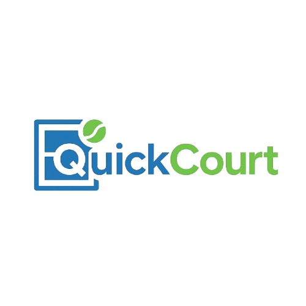

# QuickCourt — A Local Sports Facility Booking Platform

<br />
<div align="center">
  <a href="https://github.com/Aaditya-T/QuickCourt">
    
  </a>

  <h3 align="center">QuickCourt</h3>

  <p align="center">
    A modern sports facility booking platform that connects athletes with local courts and enables community match organization
    <br />
    <strong>🏆 Odoo Hackathon August 2025 - Top Team Project</strong>
    <br />
    Built by Team ZeroDay in 24 hours
  </p>
</div>

## 🏆 Achievement

This project was created for **Odoo Hackathon August 2025**, a prestigious hackathon where we proudly secured a position among the **top teams**. The entire platform was built from concept to working prototype in just **24 hours**.


[](https://github.com/Aaditya-T/QuickCourt/graphs/contributors)
[](https://github.com/Aaditya-T/QuickCourt/stargazers)

## 👥 Contributors

**Project Lead: [Naishadh Rana](https://github.com/Zenith1009)** 🎯

<table>
<tr>
    <td align="center">
        <a href="https://github.com/Zenith1009">
            
            <br />
            <sub><b>Naishadh Rana</b></sub>
        </a>
        <br />
        <sub>Backend Development & Database Design</sub>
    </td>
    <td align="center">
        <a href="https://github.com/Aaditya-T">
            
            <br />
            <sub><b>Aaditya Thakkar</b></sub>
        </a>
        <br />
        <sub>Full-stack Development</sub>
    </td>
    <td align="center">
        <a href="https://github.com/Smitvd22">
            
            <br />
            <sub><b>Smit Deoghare</b></sub>
        </a>
        <br />
        <sub>Frontend Development & UI/UX</sub>
    </td>
    <td align="center">
        <a href="https://github.com/RDisCoding">
            
            <br />
            <sub><b>Rudray Dave</b></sub>
        </a>
        <br />
        <sub>Backend Development & Integrations</sub>
    </td>
</tr>
</table>

## Project Purpose

QuickCourt serves as a comprehensive sports facility booking platform designed to:

- **Connect** sports enthusiasts with local facilities for various sports like badminton, tennis, basketball
- **Enable** seamless booking with real-time availability and secure payment processing
- **Foster** community engagement through match organization and participation features
- **Empower** facility owners with management tools and analytics dashboards
- **Provide** administrators with comprehensive oversight and reporting capabilities

This platform bridges the gap between sports facility management and community engagement, making sports more accessible for everyone.

## Key Features

- **Smart Facility Search** - Advanced filtering by sport type, location, price range, and amenities
- **Time-slot Booking System** - Real-time availability checking with conflict prevention
- **Community Match Making** - Create and join matches with other players
- **Payment Integration** - Secure payment processing with Stripe
- **Owner Dashboard** - Complete facility management with analytics
- **Admin Panel** - User management and platform oversight
- **Mobile Responsive** - Optimized for all devices and screen sizes

## Tech Stack


---


### Frontend Framework
- **React 18** with TypeScript for modern component architecture
- **Wouter** for lightweight client-side routing
- **Tailwind CSS** for utility-first styling
- **Radix UI** and **shadcn/ui** for accessible, beautiful components

### Backend & Database
- **Node.js** with **Express.js** for robust server architecture
- **Drizzle ORM** with PostgreSQL for type-safe database operations
- **Neon** serverless PostgreSQL database
- **JWT Authentication** with secure password hashing

### External Services
- **Stripe** for payment processing
- **AWS S3** for file uploads and storage
- **React Query** for server state management

---

## Getting Started

### Prerequisites

Make sure you have the following installed:
- **Node.js** (version 18 or higher)
- **npm** package manager
- **PostgreSQL** database
- **AWS S3** bucket (for file uploads)
- **Stripe** account (for payments)

<details>
<summary><strong>Want to install QuickCourt?</strong></summary>


### Installation

1. **Clone the repository**
   ```bash
   git clone https://github.com/Aaditya-T/QuickCourt.git
   cd QuickCourt
   ```

2. **Install dependencies**
   ```bash
   npm install
   ```

3. **Set up environment variables**
   
   Create environment files and add the following variables:
   ```env
   # Database
   DATABASE_URL=your_postgresql_database_url
   
   # Authentication
   JWT_SECRET=your_jwt_secret
   
   # AWS S3
   AWS_ACCESS_KEY_ID=your_aws_access_key
   AWS_SECRET_ACCESS_KEY=your_aws_secret_key
   AWS_BUCKET_NAME=your_s3_bucket_name
   AWS_REGION=your_aws_region
   
   # Stripe
   STRIPE_PUBLIC_KEY=your_stripe_public_key
   STRIPE_SECRET_KEY=your_stripe_secret_key
   ```

4. **Set up the database**
   ```bash
   npm run db:generate
   npm run db:push
   ```

5. **Start the development server**
   ```bash
   npm run dev
   ```

6. **Open your browser**
   
   Navigate to [http://localhost:3000](http://localhost:3000) to see the application running.

</details>

### Available Scripts

| Command | Description |
|---------|-------------|
| `npm run dev` | Start development server |
| `npm run build` | Build for production |
| `npm run start` | Start production server |
| `npm run check` | TypeScript type checking |
| `npm run db:push` | Push schema to database |
| `npm run db:generate` | Generate migrations |

## Project Structure

```
QuickCourt/
├── client/                 # React frontend
│   ├── src/
│   │   ├── components/     # Reusable UI components
│   │   ├── pages/          # Application pages
│   │   ├── hooks/          # Custom React hooks
│   │   ├── lib/           # Utilities and configurations
│   │   └── types/         # TypeScript type definitions
├── server/                # Express backend
│   ├── routes/           # API route handlers
│   └── services/         # Business logic services
├── shared/               # Shared types and validations
└── migrations/           # Database migrations
```

## Acknowledgments

- **Odoo** for organizing the hackathon and providing an amazing platform for innovation
- **Radix UI** and **shadcn/ui** for the excellent component libraries  
- **Neon** for providing serverless PostgreSQL database solutions
- The amazing open-source community for the tools and libraries that made this project possible

---

<div align="center">

**Made with enthusiasm and passion by Team ZeroDay during Odoo Hackathon August 2025**

</div>
